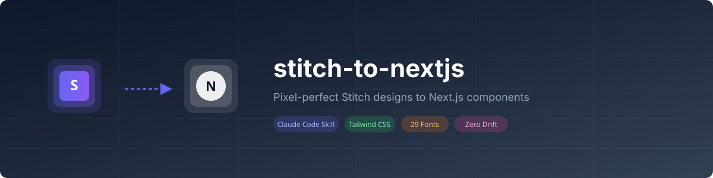

<p align="center">
  
</p>

<p align="center">
  <strong>Convert Google Stitch designs into pixel-perfect Next.js components</strong>
</p>

<p align="center">
  <a href="#quick-install">Quick Install</a> -
  <a href="#what-it-does">What It Does</a> -
  <a href="#usage">Usage</a> -
  <a href="#how-it-works">How It Works</a> -
  <a href="#configuration">Configuration</a> -
  <a href="QUICKSTART.md">Quick Start Guide</a>
</p>

<p align="center">
  
  
  
  
  
</p>

---

## The Problem

When you convert Stitch designs to code manually or with generic AI tools, things drift:

| What Stitch designed | What you get |
|---|---|
| `Inter` at `15px` | `text-sm` (14px) |
| `#1E293B` background | `bg-slate-800` (close but wrong) |
| `18px` padding | `p-4` (16px) |
| Specific hero image | Placeholder or missing |
| `border-radius: 12px` | `rounded-lg` (8px) |

**stitch-to-nextjs** eliminates this drift entirely. It extracts the exact HTML, CSS, fonts, colors, and images from your Stitch design and produces a Next.js component that is visually identical.

---

## Quick Install

### Option 1: Copy the skill file (simplest)

```bash
curl -o ~/.claude/commands/stitch-to-nextjs.md \
  https://raw.githubusercontent.com/shaishmini/stitch-to-nextjs/main/skills/stitch-to-nextjs/SKILL.md
```

### Option 2: Clone and symlink

```bash
git clone https://github.com/shaishmini/stitch-to-nextjs.git
ln -s "$(pwd)/stitch-to-nextjs/skills/stitch-to-nextjs/SKILL.md" \
  ~/.claude/commands/stitch-to-nextjs.md
```

### Option 3: Manual

Copy the contents of [`skills/stitch-to-nextjs/SKILL.md`](skills/stitch-to-nextjs/SKILL.md) into `~/.claude/commands/stitch-to-nextjs.md`.

---

## Prerequisites

### Required

- [Claude Code](https://claude.ai/code) CLI installed
- A [Google Stitch](https://stitch.withgoogle.com) account with at least one project
- Built-in Stitch MCP enabled in Claude Code (available by default on claude.ai)

### Recommended (for best results)

Install [davideast/stitch-mcp](https://github.com/davideast/stitch-mcp) for HTML code export and screenshot comparison:

```bash
npx @_davideast/stitch-mcp init
```

Then add to your project's `.mcp.json`:

```json
{
  "mcpServers": {
    "stitch-dev": {
      "command": "npx",
      "args": ["-y", "@_davideast/stitch-mcp", "proxy"]
    }
  }
}
```

This unlocks `get_screen_code` (exact HTML/Tailwind export) and `get_screen_image` (screenshot for visual comparison).

---

## What It Does

| Feature | Description |
|---|---|
| **Pixel-perfect CSS** | Preserves exact values - `text-[15px]`, `bg-[#1E293B]`, `p-[18px]` - never rounds to Tailwind defaults |
| **Font matching** | Maps all 29 Stitch fonts to `next/font/google` with CSS variables |
| **Image downloading** | Downloads all images from Stitch CDN before URLs expire, saves to `public/assets/` |
| **Design tokens** | Extracts colors, roundness, color mode from Stitch design systems |
| **ShadCN mapping** | Detects ShadCN/UI and maps Stitch patterns to ShadCN components with exact style overrides |
| **Server Components** | Uses React Server Components by default, extracts `"use client"` only when needed |
| **Tailwind v3 + v4** | Auto-detects your Tailwind version and generates compatible code |
| **Visual validation** | Saves Stitch screenshot as reference for side-by-side comparison |

---

## Usage

### Browse your Stitch projects

```
/stitch-to-nextjs list
```

### Convert a specific screen

```
/stitch-to-nextjs 4044680601076201931 98b50e2ddc9943efb387052637738f61
```

### Convert by project name

```
/stitch-to-nextjs "My Landing Page" "Hero Section"
```

---

## How It Works

The skill runs a 7-phase pipeline:

```
 Phase 1      Phase 2       Phase 3        Phase 4          Phase 5        Phase 6       Phase 7
----------   ----------   -----------   ---------------   -----------   -----------   -----------
 Discovery    Design       HTML/Code     Component         Asset          Font          Visual
 & Setup      Tokens       Extraction    Generation        Download       Setup         Validation
----------   ----------   -----------   ---------------   -----------   -----------   -----------
 Resolve      Extract      get_screen    Convert to        Download      Load fonts    Screenshot
 project &    fonts,       _code for     Next.js TSX       images to     via next/     comparison
 screen IDs   colors,      exact HTML    with exact        public/       font/google   + checklist
              roundness    + Tailwind    Tailwind classes  assets/
```

### Phase 1: Discovery

- Resolves project/screen IDs from names or IDs
- Fetches project details, screen data, and design system
- Detects your Next.js project setup (Tailwind version, ShadCN, existing fonts)

### Phase 2: Design Token Extraction

- Maps Stitch font enums to `next/font/google` imports (29 fonts supported)
- Extracts Material Design 3 color tokens (primary, secondary, tertiary, neutral)
- Maps roundness values to Tailwind border-radius classes

### Phase 3: HTML/Code Extraction

- Uses `get_screen_code` from davideast/stitch-mcp (if available) for exact HTML
- Falls back to built-in Stitch MCP `get_screen` response
- Captures screenshot via `get_screen_image` for validation

### Phase 4: Component Generation

Follows a strict CSS fidelity hierarchy:

1. **Stitch Tailwind classes verbatim** - never renamed or simplified
2. **Arbitrary values** for custom measurements - `text-[15px]`, `w-[372px]`, `bg-[#1E293B]`
3. **tailwind.config.ts extensions** only for repeating design tokens
4. **Inline styles** only as a last resort for CSS Tailwind cannot express

### Phase 5: Asset Handling

- Scans HTML for all `` tags, `background-image` URLs, and SVG references
- Downloads images immediately (Stitch CDN URLs can expire)
- Converts to `next/image` `<Image>` components with proper dimensions

### Phase 6: Font Setup

- Adds missing fonts via `next/font/google` with CSS variables
- Handles the METROPOLIS edge case (not on Google Fonts - uses `next/font/local`)
- Extends Tailwind config with font family references

### Phase 7: Validation

- Saves Stitch screenshot as reference image
- Presents a pixel-perfect validation checklist
- Suggests running the dev server for side-by-side comparison

---

## Output Structure

The skill generates files following this structure:

```
src/
  components/
    stitch/
      [ScreenName]/
        [ScreenName].tsx            # Main Server Component
        [ScreenName].client.tsx     # Client interactive parts (if needed)
        index.ts                    # Re-export
public/
  assets/
    stitch/
      [screen-name]/
        hero-image.png              # Downloaded images
        stitch-reference.png        # Design screenshot for comparison
```

---

## Supported Stitch Fonts

All 29 Stitch design system fonts are mapped to `next/font/google`:

| Stitch Font | next/font Import | CSS Variable |
|---|---|---|
| INTER | `Inter` | `--font-inter` |
| GEIST | `Geist` | `--font-geist` |
| DM_SANS | `DM_Sans` | `--font-dm-sans` |
| MANROPE | `Manrope` | `--font-manrope` |
| MONTSERRAT | `Montserrat` | `--font-montserrat` |
| PLUS_JAKARTA_SANS | `Plus_Jakarta_Sans` | `--font-plus-jakarta-sans` |
| SPACE_GROTESK | `Space_Grotesk` | `--font-space-grotesk` |
| RUBIK | `Rubik` | `--font-rubik` |
| SORA | `Sora` | `--font-sora` |
| ... | [28 more](skills/stitch-to-nextjs/references/font-mapping.md) | ... |

> METROPOLIS is handled via `next/font/local` since it's not available on Google Fonts.

---

## Configuration

### MCP Setup

The skill works with two MCP servers:

| MCP Server | Tools Used | Required? |
|---|---|---|
| Built-in Stitch (Claude.ai) | `get_screen`, `get_project`, `list_screens`, `list_design_systems` | Yes |
| [davideast/stitch-mcp](https://github.com/davideast/stitch-mcp) | `get_screen_code`, `get_screen_image` | Recommended |

### Customization

The skill auto-detects your project setup:

- **Tailwind version** - from `tailwind.config.ts` or CSS imports
- **ShadCN/UI** - from `components/ui/` directory or `components.json`
- **Existing fonts** - from root `layout.tsx`
- **Package manager** - from lockfile type

---

## Examples

### Simple landing page section

```
/stitch-to-nextjs list
> Select project: "Marketing Site"
> Select screen: "Hero Section"
```

Generates:
- `src/components/stitch/HeroSection/HeroSection.tsx` - Server Component with exact Tailwind
- `public/assets/stitch/hero-section/hero-bg.jpg` - Downloaded hero image
- Updated `layout.tsx` with required fonts
- Validation checklist

### Dashboard with interactive elements

```
/stitch-to-nextjs 123456789 abcdef123456
```

Generates:
- `src/components/stitch/Dashboard/Dashboard.tsx` - Server Component (layout)
- `src/components/stitch/Dashboard/Dashboard.client.tsx` - Client Component (charts, filters)
- `src/components/stitch/Dashboard/index.ts` - Re-export
- All chart images and icons downloaded

---

## Comparison

| Feature | Manual Conversion | Generic AI | stitch-to-nextjs |
|---|---|---|---|
| Font accuracy | Approximate | Often wrong | Exact match |
| Color fidelity | Copy-paste hex | Nearest Tailwind | Exact hex values |
| Spacing precision | Rounded to scale | Rounded to scale | Exact pixel values |
| Image handling | Manual download | Placeholders | Auto-download |
| Design tokens | Manual extraction | Ignored | Auto-extracted |
| ShadCN integration | Manual | No | Auto-detected |
| Validation | Visual inspection | None | Screenshot + checklist |

---

## Troubleshooting

### "get_screen_code not found"

Install [davideast/stitch-mcp](https://github.com/davideast/stitch-mcp):

```bash
npx @_davideast/stitch-mcp init
```

The skill will fall back to built-in Stitch MCP tools, but fidelity may be lower.

### Images not loading

Stitch CDN URLs expire. The skill downloads images immediately, but if you re-run the conversion, old URLs may be invalid. Re-run the skill to get fresh URLs.

### Font not loading

Check that the font is added to your root `layout.tsx` and the CSS variable is applied to the `<html>` element. The skill handles this automatically, but manual changes may have overwritten it.

---

## Contributing

Contributions are welcome! See [CONTRIBUTING.md](CONTRIBUTING.md) for guidelines.

Ideas for contributions:
- Support for additional frameworks (React, Svelte, Vue)
- Improved responsive design handling
- Automated visual regression testing
- Additional design system token extraction

---

## License

[MIT](LICENSE) - Use it however you want.

---

## Credits

- [Google Stitch](https://stitch.withgoogle.com) - AI-powered UI design tool
- [davideast/stitch-mcp](https://github.com/davideast/stitch-mcp) - Stitch MCP server for code/image export
- [Claude Code](https://claude.ai/code) - AI coding agent by Anthropic

---

<p align="center">
  Built for developers who care about design fidelity.
</p>
